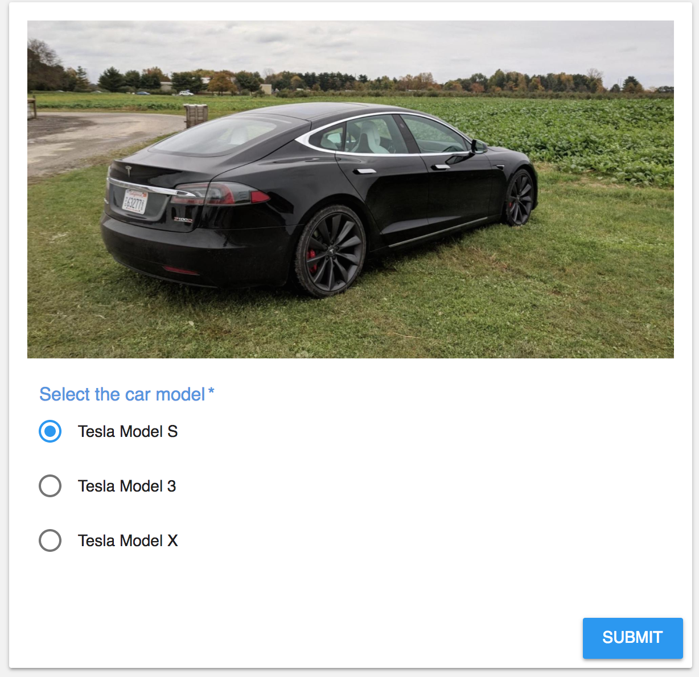
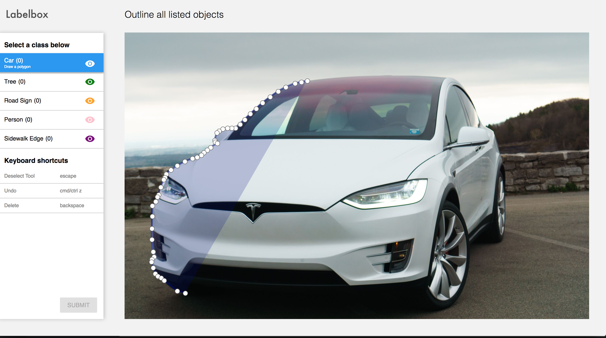

# Labelbox

All labeling tasks share the theme of "data in labels out". This repo contains a set of highquality labeling frontends to aid in many data labeling projects.

```
           -----------------------
           |                     |
           |                     |
           |                     |
Data -->   |  Labeling Frontend  |   --> Label
           |                     |
           |                     |
           |                     |
           -----------------------
```

Please see [labeling frontend templates](#labeling-frontend-templates) for templates relevant to your labeling task.

Once you've found a template for your job you can either host and manage the data labeling yourself or deploy your frontend to our hosting service at (labelbox.io)[https://www.labelbox.io/].


# Labeling Frontend Templates

## Image Classification

[Code Here](https://github.com/Labelbox/Labelbox/tree/master/templates/image-classification)


## Image Segmentation

[Code Here](https://github.com/Labelbox/Labelbox/tree/master/templates/image-segmentation)



# Create a New Labeling Frontend

Step 1. Attach the Labelbox's client side api.

```html
<script src="https://api.labelbox.io/client/v0.1/labeling-api.js"></script>
```

Step 2. Get a row to label

```javascript
Labelbox.fetchNextAssetToLabel().then((dataToLabel) => {
  // ... draw to screen for user to view and label
});
```

Step 3. Save the label for a row

```javascript
Labelbox.setLabelForAsset(label); // labels the asset currently on the screen
```

Full Example

```html
<script src="https://labeling-api-nmntfiowht.now.sh/"></script>
<div id="form"></div>
<script>
function next(label){
  if (label) {
    Labelbox.setLabelForAsset(label);
  }
  Labelbox.fetchNextAssetToLabel().then(drawItem);
}

function drawItem(dataToLabel){
  const labelForm = `
    </img>
    <div style="display: flex;">
      <button onclick="next('bad')">Bad Quality</button>
      <button onclick="next('good')">Good Quality</button>
    </div>
  `;
  document.querySelector('#form').innerHTML = labelForm;
}

next();
</script>
```
