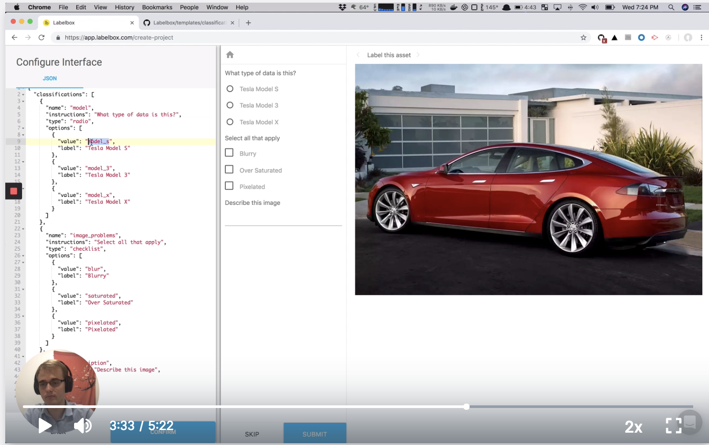
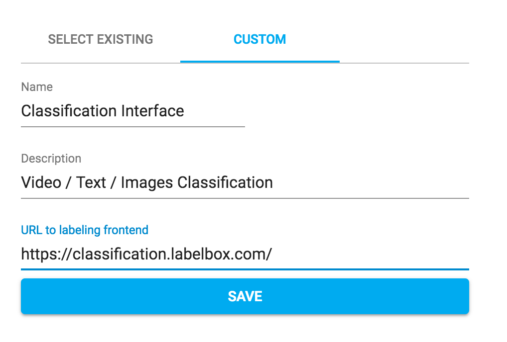

## Video Walkthrough

[](https://www.useloom.com/share/c8bbd247ee674b6f8c2c6c34da2e3575)

## Running this example

1. Create an account on labelbox
2. Make a new project, "Classification Example"
3. Import the file "example-classification-data.json"
4. Open index.html in your browser
5. Select your new project "Classification Example"

## Installing template into Labelbox

To install this template and use it with realtime customization following the below steps.

1. Create a new custom interface with this URL https://classification.labelbox.com/.



2. Click edit and paste this JSON in over default JSON

```
{
  "classifications": [
    {
      "name": "model",
      "instructions": "Select the car model",
      "type": "radio",
      "options": [
        {
          "value": "model_s",
          "label": "Tesla Model S"
        },
        {
          "value": "model_3",
          "label": "Tesla Model 3"
        },
        {
          "value": "model_x",
          "label": "Tesla Model X"
        }
      ]
    },
    {
      "name": "image_problems",
      "instructions": "Select all that apply",
      "type": "checklist",
      "options": [
        {
          "value": "blur",
          "label": "Blurry"
        },
        {
          "value": "saturated",
          "label": "Over Saturated"
        },
        {
          "value": "pixelated",
          "label": "Pixelated"
        }
      ]
    },
    {
      "name": "description",
      "instructions": "Describe this image",
      "type": "text"
    }
  ]
}
```